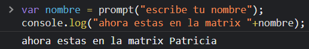
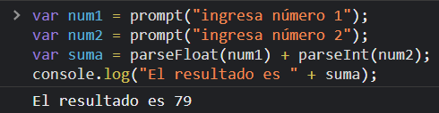
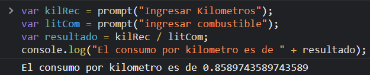
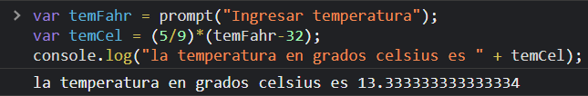
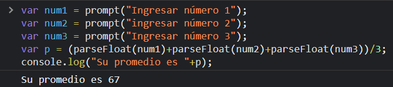
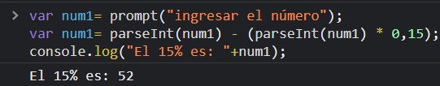
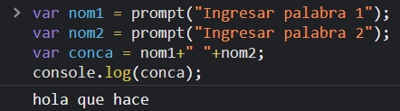
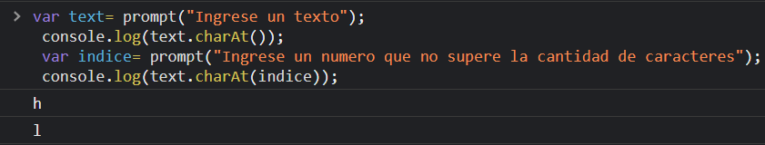

# Taller 6 JavaScript

## Participantes

Maria Paula Galvis Vasquez

## Ejercicio 1
```Javascript
var nombre = prompt("escribe tu nombre");
console.log("ahora estas en la matrix "+nombre);
```


## Ejercicio 2
```Javascript
var num1 = prompt("ingresa número 1");
var num2 = prompt("ingresa número 2");
var suma = parseFloat(num1) + parseInt(num2);
console.log("El resultado es " + suma);
```


## Ejercicio 3
```Javascript
var num1 = prompt("ingresa número 1");
var num2 = prompt("ingresa número 2");
var suma = parseInt(num1) + parseInt(num2);
var num3 = prompt("ingresa número 3");
var multi = suma * num3;
console.log("El resultado es " + multi);
```


## Ejercicio 4
```Javascript
var kilRec = prompt("Ingresar Kilometros");
var litCom = prompt("ingresar combustible");
var resultado = kilRec / litCom;
console.log("El consumo por kilometro es de " + resultado);
```


## Ejercicio 5
```Javascript
var temFahr = prompt("Ingresar temperatura");
var temCel = (5/9)*(temFahr-32);
console.log("la temperatura en grados celsius es " + temCel);
```


## Ejercicio 6
```Javascript
var num1 = prompt("Ingresar número 1");
var num2 = prompt("ingresar número 2");
var num3 = prompt("Ingresar número 3");
var p = (parseFloat(num1)+parseFloat(num2)+parseFloat(num3))/3;
console.log("Su promedio es "+p);
```


## Ejercicio 7
```Javascript
var num1= prompt("ingresar el número");
var num1= parseInt(num1) - (parseInt(num1) * 0,15);
console.log("El 15% es: "+num1);
```


## Ejercicio 8
```Javascript
var nom1 = prompt("Ingresar palabra 1");
var nom2 = prompt("Ingresar palabra 2");
var conca = nom1+" "+nom2;
console.log(conca);
```


## Ejercicio 9
```javascript 
 var text= prompt("Ingrese un texto");
 console.log(text.charAt());
 var indice= prompt("Ingrese un numero que no supere la cantidad de caracteres");
 console.log(text.charAt(indice));
```


## Ejercicio 10
```javascript 
var cant= parseInt(prompt("¿Cuantos shows musicales ha visto el ultimo año ?"));
cant >3;
```


## Ejercicio 11
```javascript 
var fecha= prompt("Ingrese por favor una fecha de esta manera : DDMMAAAA");
fecha.charAt(0)+fecha.charAt(1)+"/"+ fecha.charAt(2)+fecha.charAt(3)+"/"+ fecha.charAt(4)+ fecha.charAt(5)+ fecha.charAt(6)+ fecha.charAt(7);
```


## Ejercicio 12
```javascript 
 var num1= parseInt(prompt("Ingrese un numero"));
 var par = num1 % 2;
 par == 0;
```


## Ejercio 13
```javascript 
var edad = parseInt(prompt("Ingrese su edad "));
var art =parseInt(prompt("Ingrese la cantidad de articulos que ha comprado"));
edad > 18 && art > 1;
```


## Ejercicio 14
```javascript 
var text= prompt("Ingrese un texto");
if (text.length % 2 == 0) {
  console.log("False");
}
else {
  console.log("True");
}
```


## Ejercicio 15
```javascript 
var pal1= prompt("Ingrese la palabra 1");
 var pal2= prompt("Ingrese la palabra 2");
 if (pal1.length<pal2.length){
      console.log("True");
 }
 else {
  console.log("False");
 }
```


## Ejercicio 16
```javascript 
var nom1= prompt("Ingres su nombre");
var nom2= prompt("Ingrese el nombre de otra persona");
(nom1.charAt()==nom2.charAt() || nom1.charAt(nom1.length-1)==nom2.charAt(nom2.length-1));
```


## Ejercicio 17
```javascript 
var num= prompt("Ingrese un numero entero");
 Math.abs (num);
```
```javascript 
 var num= prompt("Ingrese un numero entero")
 if (num>0){
   num= num
 }
 else{
   (num *(-1))
 }
```


## Ejercicio 18
```javascript 
var num1= prompt("Ingrese un numero");
var num2= prompt("Ingrese otro numero");
Math.max (num1, num2);
```
```javascript 
var num1= prompt("Ingrese un numero")
var num2= prompt("Ingrese otro numero")

if(num1<num2){
  num1
}
else{
  num2
}
```


## EJERCICIO 19

Escribir un programa que solicite al usuario una letra y, si es una vocal, muestre el mensaje "Es vocal". Verificar si el usuario ingreso un string de más de un carácter y, en ese caso, informarle que no se puede procesar el dato.

```javascript 
var voc= prompt("Ingrese una letra");
if (voc.length>1){
    console.log("No se puede procesar el dato ya que tiene mas de 1 caracter")
}
 else if (voc=="a"|| voc=="e" || voc=="i" || voc=="o" || voc=="u"){
    console.log("Es vocal");  
  }
  else {
    console.log("No es vocal")
  }
```


## EJERCICIO 20


```javascript 
var num1= parseFloat(prompt("Ingrese un numero"));
var num2= parseFloat(prompt("Ingrese otro numero"));
var num3=parseFloat(prompt("Ingrese otro numero"));
Math.min (num1, num2, num3)
```


